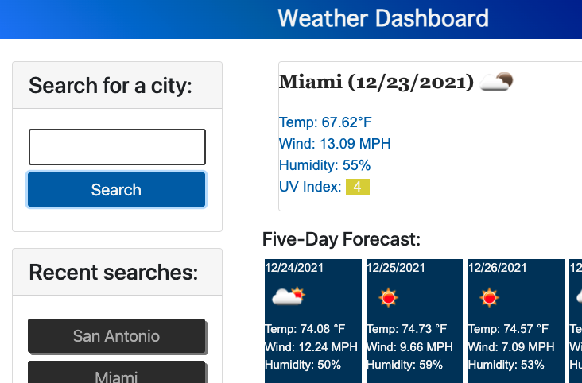

# Weather Informer Index

## Functionality: 
- Search for a city and have information displayed about today's weather including the temp, wind MPH, humidity, and UV index
- Also display the forecast for the next five days
- The city is added to a list of recent searches where the previous info can be accessed again from local storage

https://gregoryjohncarter.github.io/weather-informer-index/

